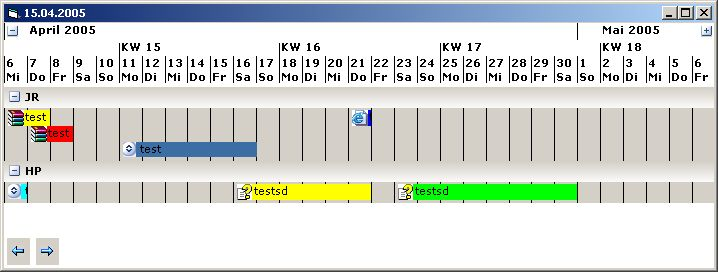



## Multilingual Timeline Control for Appoiments

### Description

This Control shows any Appoiments in a timeline.

The Timeline is variable from any date.

You can Display one Day or more.

In this example will display 2 Users (JR and HP).

He has different Timelines. Try it out.

The Caption for Month and Years comes from your System hmmm i like this.
 
### More Info
 
a multilingual timeline on screen

             |
---                |---
**Submitted On**   |2005-03-10 15:54:20
**By**             |[J\. Rostek](https://github.com/Planet-Source-Code/PSCIndex/blob/master/ByAuthor/j-rostek.md)
**Level**          |Beginner
**User Rating**    |4.5 (59 globes from 13 users)
**Compatibility**  |VB 6\.0
**Category**       |[Custom Controls/ Forms/  Menus](https://github.com/Planet-Source-Code/PSCIndex/blob/master/ByCategory/custom-controls-forms-menus__1-4.md)
**World**          |[Visual Basic](https://github.com/Planet-Source-Code/PSCIndex/blob/master/ByWorld/visual-basic.md)
**Archive File**   |[Multilingu187268462005\.zip](https://github.com/Planet-Source-Code/j-rostek-multilingual-timeline-control-for-appoiments__1-59848/archive/master.zip)

### API Declarations

any

